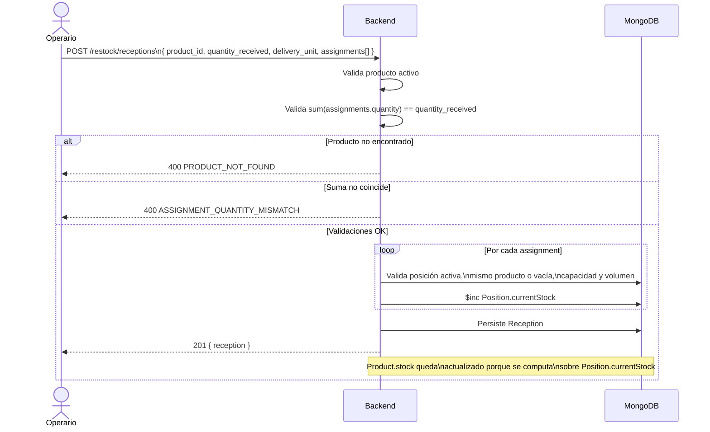

# RFC — Restock Orders & Reception de Mercadería

> **Grupo 4 — Backend y API**
>
> Extiende el [`RFC_SmartWarehouse_Backend.md`](./RFC_SmartWarehouse_Backend.md) con el flujo de reposición de stock (restock) y recepción de mercadería, a partir del doc de negocio "Gestión de Stock y Recepción de Mercadería". No reemplaza ni modifica ninguna sección del RFC principal.

---

## 0. Carátula

| Revisor | Estado |
|---|---|
| Mateo Urrutia | En progreso |

---

## 1. Objetivo

Definir cómo el backend implementa las reglas de negocio del documento "Gestión de Stock y Recepción de Mercadería": una `RestockOrder` es el pedido a un proveedor (no toca stock), y una `Reception` (remito) es lo efectivamente recibido — la única operación que incrementa el stock, distribuyéndolo entre una o más posiciones del almacén.

## 2. Alcance

**Incluido:** alta de `RestockOrder`, alta de `Reception` con asignación a posiciones y actualización de stock, mapeo 1:1 contra las reglas de negocio RN‑01 a RN‑08.

**Fuera de alcance (este milestone):**
- Qué hacer ante diferencias entre lo solicitado y lo recibido — el doc de negocio lo deja explícitamente para un hito posterior.
- Edición/reversión de un remito ya registrado.
- Lifecycle de estados sobre `RestockOrder` (aprobación, cancelación) — hoy es un registro histórico simple; se agrega si el negocio lo pide.

## 3. Estado actual del backend (lo que ya existe)

No partimos de cero — buena parte del modelo de stock ya está resuelto:

| Pieza | Dónde | Qué hace |
|---|---|---|
| `Product` | `domain/Product.java` | No guarda `stock` propio. RN‑01/RN‑02 quedan resueltos por diseño: el stock siempre se computa, nunca se desincroniza. |
| Cómputo de stock | `ProductService.computeAvailableStock` | Suma `Position.currentStock` de las posiciones activas de un producto. Ya implementa RN‑02. |
| `Position` | `domain/Position.java` | Un producto + `currentStock` por posición, agrupadas por `Line`/`Zone`. `currentStock` es acumulativo — no requiere cambios para RN‑08. |
| `StockSize` | `domain/StockSize.java` | Enum `CAJA` / `MEDIO_PALLET` / `PALLET`, por volumen. Ya modela "unidad de entrega"; hoy se usa en `validate-fit` y como `Position.sizeStockToSave`. Se reutiliza tal cual. |
| Asignación manual | `PositionService.updatePosition` | Asigna producto + cantidad a **una** posición con validación de capacidad/volumen. Es la base de la asignación al almacén, pero no soporta repartir una recepción entre varias posiciones en una sola operación transaccional — eso es lo nuevo. |
| `Order` (**no confundir**) | `api/order/`, `domain/Order.java` | Es el pedido de **despacho al cliente**: reserva y luego **descuenta** stock (`StockDrainService`). Concepto distinto al `RestockOrder` de este RFC — de ahí el namespace separado. |

## 4. Diseño — entidades nuevas

### 4.1. `RestockOrder`

| Campo | Tipo | Descripción |
|---|---|---|
| id | string | Identificador único |
| product_id | string | Producto solicitado |
| quantity_requested | integer | Cantidad solicitada al proveedor |
| supplier | string | Proveedor al que se le hizo el pedido |
| requested_by_user_id | string | Usuario que generó el pedido |
| created_at | timestamp (UTC) | Fecha de creación |

No tiene efecto sobre stock (RN‑03) — es puramente informativo, un registro de qué se pidió.

### 4.2. `Reception` (remito)

| Campo | Tipo | Descripción |
|---|---|---|
| id | string | Identificador único |
| restock_order_id | string \| null | Referencia opcional al pedido — puede no coincidir o no existir |
| product_id | string | Producto recibido |
| quantity_received | integer | Cantidad efectivamente recibida (RN‑05: es la que se usa, nunca `quantity_requested`) |
| delivery_unit | enum (`StockSize`) | Cómo llegó físicamente: `CAJA` / `MEDIO_PALLET` / `PALLET` (RN‑06) |
| supplier | string | Proveedor que entregó |
| assignments | array\<Assignment\> | Reparto entre posiciones — ver 4.2.1 |
| received_by_user_id | string | Usuario que registró la recepción |
| created_at | timestamp (UTC) | Fecha de registro |

#### 4.2.1. `Assignment`

| Campo | Tipo | Descripción |
|---|---|---|
| position_id | string | Posición del almacén donde se ubica parte de la mercadería |
| quantity | integer | Cantidad asignada a esa posición |

`sum(assignments[].quantity)` **debe** ser igual a `quantity_received` — si no, la request se rechaza (RN‑07).

## 5. Reglas de negocio → implementación

| RN | Regla | Cómo se cumple |
|---|---|---|
| RN‑01 | Un stock total único por producto | `Product` no lo persiste — se deriva siempre. Sin cambios. |
| RN‑02 | Stock total = suma de posiciones | `ProductService.computeAvailableStock`. Sin cambios. |
| RN‑03 | `RestockOrder` no modifica stock | `POST /restock/orders` no toca `Position` ni el cómputo de stock. |
| RN‑04 | Stock solo sube al registrar el remito | `POST /restock/receptions` es el único punto de entrada que incrementa `Position.currentStock` por reposición. |
| RN‑05 | Se usa la cantidad recibida, no la solicitada | `Reception.quantity_received` es independiente de `RestockOrder.quantity_requested`; el diseño no copia valores entre ambos. |
| RN‑06 | El remito indica la unidad de entrega | `Reception.delivery_unit` (reusa `StockSize`). |
| RN‑07 | Una recepción se reparte en varias posiciones | `Reception.assignments[]`. |
| RN‑08 | Una posición admite stock de remitos distintos | `Position.currentStock` ya es acumulativo — se incrementa (`$inc`), nunca se sobrescribe. Sin cambios de modelo. |

## 6. Contratos de API

Todos los endpoints requieren JWT y rol `SUPERADMIN` o `ADMIN_WAREHOUSE`, siguiendo la convención de `PositionController`. Los listados son endpoints dedicados (`GET /restock/orders`, `GET /restock/receptions`), mismo patrón que `GET /orders` en `OrderController` — no se reusa `POST /query/{entity}`: esa Query API es el catálogo whitelisted para el equipo de dashboards (`EntityRegistry`/`EntityQueryController`), con su propio modelo de roles y de proyección de campos, y no es el canal pensado para el CRUD interno de este equipo.

### 6.1. Restock Orders

| Endpoint | Descripción |
|---|---|
| `POST /restock/orders` | Crea el pedido a proveedor. No afecta stock. |
| `GET /restock/orders` | Listado paginado, mismo patrón que `GET /orders`. Params: `productId`, `supplier`, `from`, `to`, `page`, `size`. |
| `GET /restock/orders/:id` | Detalle **enriquecido**: además de los campos propios, incluye `quantity_received_so_far` — la suma de `Reception.quantity_received` de todas las recepciones que referencian esta orden. Sirve para saber cuánto falta antes de generar un nuevo remito. |

**Request `POST /restock/orders`:**

```json
{
  "product_id": "PROD-001",
  "quantity_requested": 50,
  "supplier": "Distribuidora XYZ"
}
```

**Response `GET /restock/orders/:id`:**

```json
{
  "restock_order": {
    "id": "RSO-1001",
    "product_id": "PROD-001",
    "quantity_requested": 50,
    "quantity_received_so_far": 30,
    "supplier": "Distribuidora XYZ",
    "created_at": "2026-08-20T10:00:00Z"
  }
}
```

> `quantity_received_so_far` se computa con una agregación sobre `receptions` (mismo patrón que `ProductService.computeReservedStock`), no se persiste — así nunca queda desincronizado del histórico real de recepciones.

### 6.2. Receptions

| Endpoint | Descripción |
|---|---|
| `POST /restock/receptions` | Registra el remito **y** su asignación a posiciones en una sola llamada atómica. Incrementa stock. |
| `GET /restock/receptions` | Listado paginado, mismo patrón que `GET /orders`. Params: `productId`, `restockOrderId`, `from`, `to`, `page`, `size`. |
| `GET /restock/receptions/:id` | Detalle, incluyendo el desglose por posición. |

### 6.3. Stock y distribución de un producto

No es un endpoint nuevo — ya existe `GET /products/:id/location` (`ProductController` / `ProductService.getProductLocation`), que devuelve el desglose por posición. Cubre el `GET /products/:id/stock` de la propuesta original agregándole el total:

| Endpoint | Descripción |
|---|---|
| `GET /products/:id/location` | **(existente, se extiende)** Agrega `total_stock` a la respuesta — suma de `currentStock` sobre las posiciones ya devueltas en `locations[]`. Sin nuevo endpoint ni nueva query a Mongo. |

**Response (extendida):**

```json
{
  "total_stock": 120,
  "locations": [
    { "idPosition": "POS-A-01-01", "positionName": "A-01-01", "currentStock": 40, "idLine": "...", "idZone": "..." },
    { "idPosition": "POS-A-02-03", "positionName": "A-02-03", "currentStock": 30, "idLine": "...", "idZone": "..." }
  ]
}
```

### 6.4. Posiciones disponibles para ubicar una recepción

Endpoint nuevo — reemplaza el `GET /warehouse-positions/available` de la propuesta original, ubicado bajo `/warehouse/positions` (mismo recurso que ya expone `validate-fit`) en vez de un recurso plano con guion.

| Endpoint | Descripción |
|---|---|
| `GET /warehouse/positions/available` | Dado un producto, unidad de entrega y cantidad, devuelve las posiciones donde se puede ubicar la recepción. Params: `productId`, `deliveryUnit`, `quantity`. |

Filtra posiciones que sean:
1. `isActive = true`.
2. `sizeStockToSave == deliveryUnit` — la posición está dimensionada para ese tipo de unidad.
3. `productId` nulo (vacía) o igual al `productId` pedido — respeta que una posición aloja un único producto.

Para cada una calcula `available_units = min(maximumCapacity - currentStock, floor(sizeStockToSave.volumeCm3 / product.volume) - currentStock)`, reutilizando el mismo cálculo de volumen que `validate-fit` y `PositionService.updatePosition`. Devuelve solo las que tienen `available_units > 0`, ordenadas de mayor a menor capacidad disponible — así el operario puede ir llenando `assignments[]` de `POST /restock/receptions` de la más grande a la más chica.

**Response:**

```json
{
  "positions": [
    { "position_id": "POS-A-01-01", "position_name": "A-01-01", "available_units": 60 },
    { "position_id": "POS-A-02-03", "position_name": "A-02-03", "available_units": 22 }
  ]
}
```

### 6.5. Por qué no la Query API

Se evaluó resolver ambos listados registrando `restock_orders`/`receptions` en `EntityRegistry` y exponerlos por `POST /query/{entity}` — es el mismo mecanismo que ya listan `orders`/`products`/`positions`, y hubiera ahorrado escribir el filtro+paginación de nuevo. Se descartó: esa Query API es específicamente el catálogo whitelisted para consumidores tipo dashboard (rol `DASHBOARD`, proyección de campos, agregaciones) — el equipo que pidió estos dos GET no es ese consumidor, y forzarlos por ahí les da un contrato más pesado (`POST` con body de filtros en vez de query params simples) para un caso de uso que es un listado CRUD estándar. Si en el futuro un dashboard necesita agregar sobre `restock_orders`/`receptions`, ahí sí conviene sumarlos a `EntityRegistry` — como una necesidad aparte, no como reemplazo de estos dos GET.

**Request `POST /restock/receptions`:**

```json
{
  "restock_order_id": "RSO-1001",
  "product_id": "PROD-001",
  "quantity_received": 48,
  "delivery_unit": "PALLET",
  "supplier": "Distribuidora XYZ",
  "assignments": [
    { "position_id": "POS-A-01-01", "quantity": 30 },
    { "position_id": "POS-A-02-03", "quantity": 18 }
  ]
}
```

**Response 201:**

```json
{
  "reception": {
    "id": "RCP-2001",
    "restock_order_id": "RSO-1001",
    "product_id": "PROD-001",
    "quantity_received": 48,
    "delivery_unit": "PALLET",
    "supplier": "Distribuidora XYZ",
    "assignments": [
      { "position_id": "POS-A-01-01", "quantity": 30 },
      { "position_id": "POS-A-02-03", "quantity": 18 }
    ],
    "created_at": "2026-08-26T14:00:00Z"
  }
}
```

**Errores posibles:**

| HTTP | Código | Descripción |
|---|---|---|
| 404 | `PRODUCT_NOT_FOUND` | `product_id` no existe o está inactivo. |
| 400 | `ASSIGNMENT_QUANTITY_MISMATCH` | La suma de `assignments[].quantity` no coincide con `quantity_received`. |
| 400 | `RESTOCK_ORDER_PRODUCT_MISMATCH` | `restock_order_id` referencia un pedido de un producto distinto. |
| 404 | `RESTOCK_ORDER_NOT_FOUND` | `restock_order_id` no existe (si se envía). |
| 404 | `POSITION_NOT_FOUND` | Alguna `position_id` no existe. |
| 400 | `POSITION_INACTIVE` | Alguna posición no está activa. |
| 409 | `POSITION_ALREADY_OCCUPIED` | Alguna posición ya tiene asignado un producto distinto — se reusa el código/excepción que ya emite `PATCH /warehouse/positions/:id`, en vez de uno nuevo para el mismo caso. |
| 409 | `STOCK_EXCEEDS_CAPACITY` | La cantidad asignada excede la capacidad o el volumen de la posición (reusa la validación existente de `PositionService`). |

**Errores — `GET /warehouse/positions/available`:**

| HTTP | Código | Descripción |
|---|---|---|
| 404 | `PRODUCT_NOT_FOUND` | `productId` no existe o está inactivo. |
| 400 | `INVALID_QUANTITY` | `quantity` es cero o negativo. |

## 7. Decisiones de diseño

- **Nombre `RestockOrder`, no `Order`:** el `Order` existente es el despacho al cliente (reserva y descuenta stock). Usar el mismo nombre para el pedido a proveedor generaría colisión conceptual, no solo de ruta.
- **Paths `/restock/orders` y `/restock/receptions`, no `/orders/restock`:** nesting bajo `/orders` genera ambigüedad con `GET /orders/{id}` (¿`id=restock`?) y mezclaría dos dominios en un mismo controller/tag. El namespace `/restock/*` es nuevo, sin colisión, y agrupa el flujo de dos pasos (orden → recepción) igual que `/warehouse/*` agrupa `lines`/`positions`/`zones`. Plural siempre, consistente con el resto de la API.
- **Alta atómica, sin draft/confirm:** `POST /restock/receptions` registra el remito, asigna posiciones e incrementa stock en una sola operación. El doc de negocio no describe una brecha real entre "llegó la mercadería" y "se decidió dónde va" — un estado `draft`/`confirmed` sería complejidad sin caso de uso claro hoy. Se puede agregar si el negocio lo requiere.
- **Listados como endpoints dedicados, no Query API:** `GET /restock/orders` y `GET /restock/receptions` son controllers propios, mismo patrón que `GET /orders`. Se consideró resolverlos con `POST /query/{entity}` (ver 6.5) pero esa Query API es el canal para el equipo de dashboards, no para el CRUD interno — mezclar ambos consumidores en el mismo contrato hubiera acoplado innecesariamente a quien solo quiere un listado simple con los cambios futuros del catálogo de dashboards.
- **No se duplica el endpoint de stock:** `GET /products/:id/stock` de la propuesta original ya existe como `GET /products/:id/location` — se le agrega `total_stock` en vez de crear una ruta paralela que puede desincronizarse.
- **`/warehouse/positions/available`, no `/warehouse-positions/available`:** se ubica bajo el recurso `/warehouse/positions` que ya existe (mismo lugar que `validate-fit`), no como recurso plano nuevo — consistente con que `Line`/`Position`/`Zone` viven todos bajo `/warehouse/*`.

## 8. Flujo — registro de recepción



---

## 9. Próximos hitos (fuera de este RFC)

- Qué hacer si `quantity_received` difiere de `quantity_requested` (alertas, aprobación, etc.) — pendiente de definición de negocio.
- Lifecycle de `RestockOrder` (cancelación, expiración) si el negocio lo requiere. Hoy no hay campo `status`, así que `GET /restock/orders` no puede filtrar por estado como pedía la propuesta original — `quantity_received_so_far` en `GET /restock/orders/:id` es el proxy disponible mientras tanto (`== quantity_requested` ⇒ cubierta). Si el negocio necesita filtrar listados por estado, hay que persistir el campo.
- Corrección/reversión de una `Reception` ya registrada.
