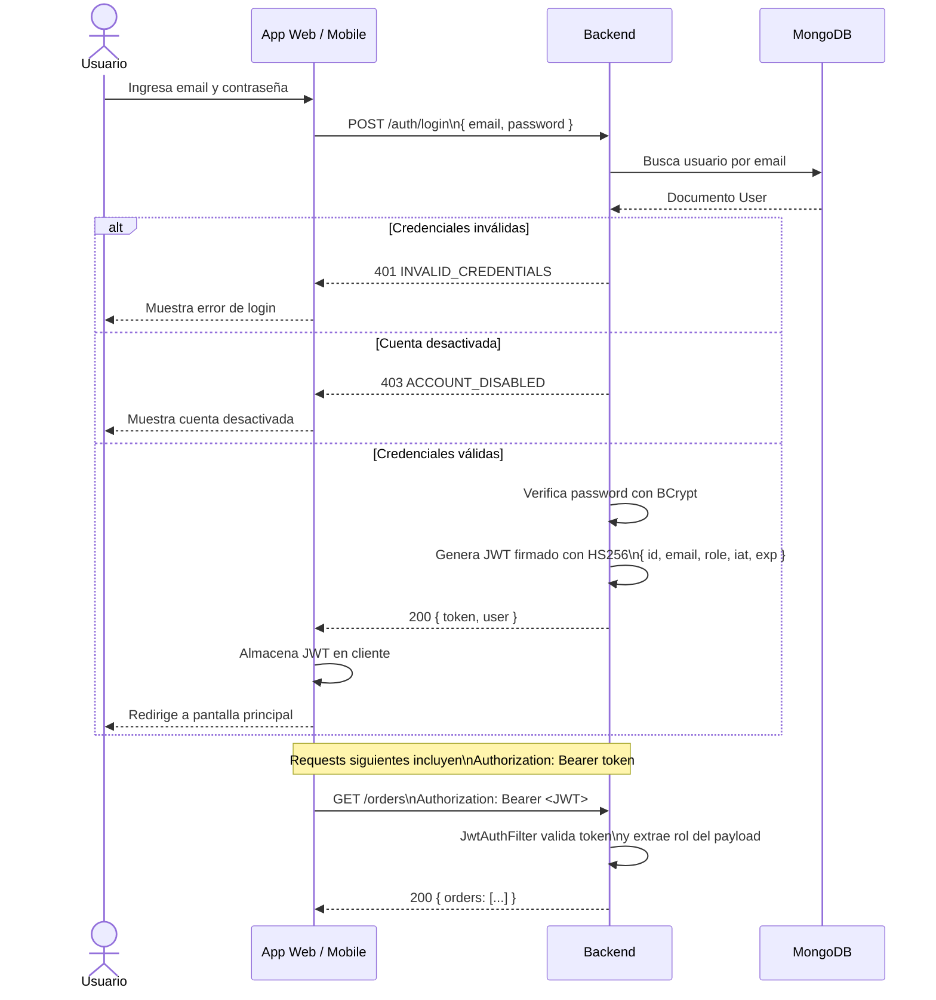
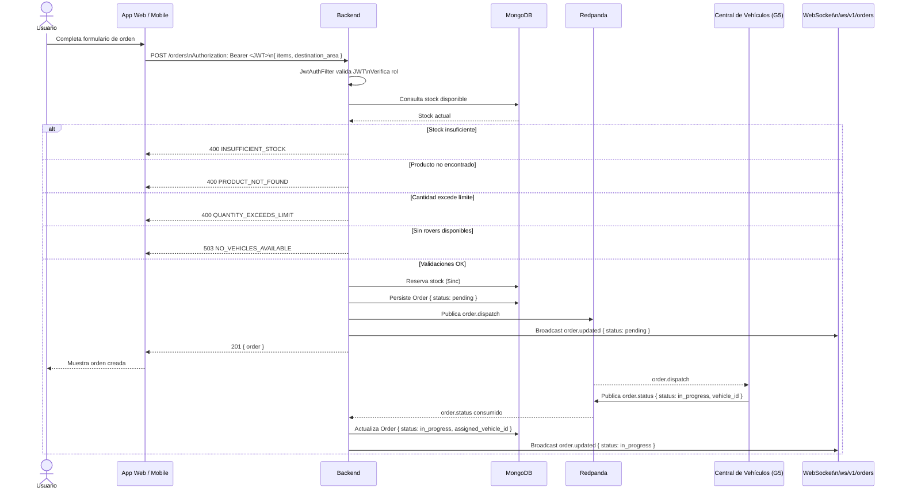
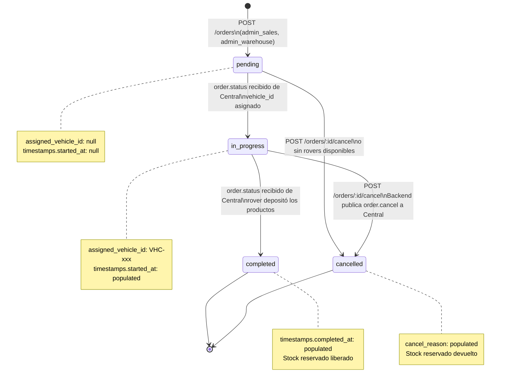
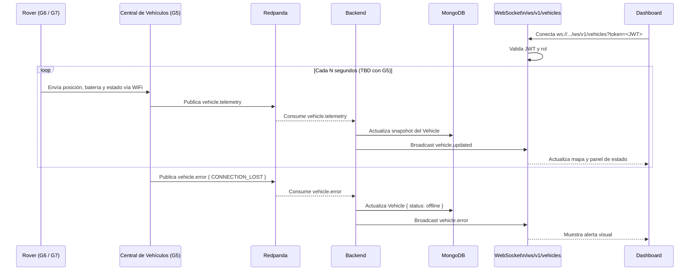
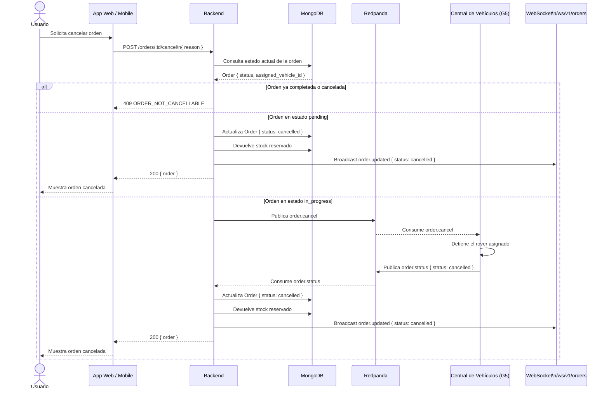
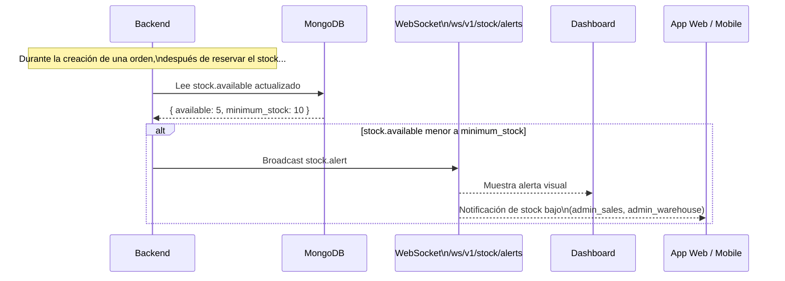
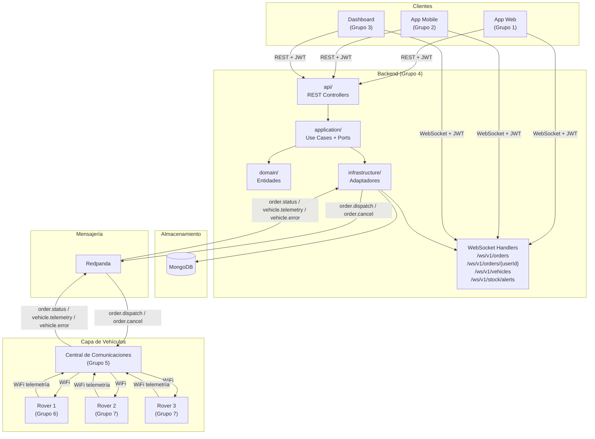

# RFC — SmartWarehouse Backend

> **Grupo 4 — Backend y API** · Ingeniería en Sistemas · 5.° año · Proyecto Integrador
>
> Este documento es la fuente de verdad del equipo de backend. Fusiona la RFC de Contratos Externos, la RFC de Arquitectura Interna y los diagramas de flujo del sistema. La comunicación con la Central de Vehículos (Grupo 5) está parcialmente definida y se completará en una RFC separada.

---

## 0. Carátula

| Revisor | Estado |
|---|---|
| Mateo Urrutia | Aprobada |
| Santiago Mercado | Aprobada |
| j.carschenboim | Aprobada |
| Persona | No iniciada |
| Persona | No iniciada |

### Documentos relacionados

| Documento | Estado | Descripción |
|---|---|---|
| RFC — Contratos Externos del Backend | Aprobada | API REST, WebSocket, entidades del sistema |
| RFC — Arquitectura Interna del Backend | En progreso | Stack, repo, capas, DB, auth, Docker |
| RFC — Comunicación Backend ↔ Central | Pendiente | Broker, topics, mensajes asíncronos (WIP con Grupo 5) |

---

## 1. Contexto general del proyecto

SmartWarehouse es un proyecto integrador que simula, a escala física, un sistema de almacén automatizado. Los alumnos diseñan e implementan un ecosistema completo donde vehículos autónomos reciben órdenes de trabajo de forma inalámbrica, navegan por un layout físico, recolectan los productos indicados y los depositan en áreas de trabajo específicas.

El sistema reúne hardware embebido, comunicaciones WiFi, backend de gestión, interfaces de usuario y un entorno físico funcional, replicando a escala los principios de la automatización logística industrial.

### Componentes del sistema

| Grupo | Área | Integrantes |
|---|---|---|
| Grupo 1 | App Web | 5 |
| Grupo 2 | App Mobile | 5 |
| Grupo 3 | Dashboard y Monitoreo | 5 |
| Grupo 4 | Backend y API | 5 |
| Grupo 5 | Comunicaciones WiFi | 4 |
| Grupo 6 | Vehículo 1 | 5 |
| Grupo 7 | Vehículos 2 y 3 | 5 |
| Grupo 8 | Layout e Integración General | 5 |

### Alcance del prototipo

- El sistema debe procesar al menos N órdenes simultáneas en la demo final.
- Los vehículos deben operar de forma autónoma sin intervención manual una vez recibida la orden.
- El estado de cada orden debe ser visible en tiempo real desde la aplicación y el dashboard.
- La comunicación entre todos los componentes debe ser inalámbrica (WiFi).

---

## 2. Arquitectura general del sistema

El Backend actúa como gateway entre los consumidores y el ecosistema de vehículos. No controla los vehículos directamente: recibe telemetría de la Central, mantiene una snapshot del estado actual y la propaga a los consumidores downstream via WebSocket.

| Capa | Tecnología | Participantes |
|---|---|---|
| Consumidores → Backend | REST + JWT / WebSocket | App Web, App Mobile, Dashboard ↔ Backend |
| Backend → Central de Vehículos | Queue asíncrona (Redpanda) | Backend publica órdenes → Central (Grupo 5) |
| Central → Backend | Queue asíncrona (Redpanda) | Central publica estados y telemetría → Backend |

### Principios de diseño

- El Backend es la fuente de verdad para órdenes, productos y usuarios.
- Todos los consumidores externos se autentican con JWT. La Central de Comunicaciones interactúa con el Backend exclusivamente a través de la queue asíncrona, sin autenticación HTTP.
- Los estados de las órdenes son el modelo canónico definido por el Backend. Los frontends pueden mostrar etiquetas distintas, pero deben mapear contra este modelo.
- Los contratos definidos en este documento son válidos para el sistema completo. Pueden extenderse en futuras versiones del RFC, pero no se romperán sin previo aviso.

---

## 3. Entidades del sistema

### 3.1. Usuario

| Campo | Tipo | Descripción |
|---|---|---|
| id | string (UUID) | Identificador único del usuario |
| email | string | Email del usuario, usado como identificador de login |
| name | string | Nombre completo |
| role | enum | Rol del usuario. Ver sección 3.6 |
| active | boolean | Indica si la cuenta está habilitada |
| created_at | string (ISO 8601) | Fecha de creación de la cuenta |

### 3.2. Producto

| Campo | Tipo | Descripción |
|---|---|---|
| id | string (UUID) | Identificador único del producto |
| sku | string | Código único de referencia del producto |
| name | string | Nombre descriptivo del producto |
| description | string | Descripción extendida |
| category | string | Categoría del producto |
| image_url | string (URL) | URL pública de la imagen del producto |
| stock.available | integer | Unidades disponibles para nuevas órdenes |
| stock.reserved | integer | Unidades reservadas por órdenes en curso |
| order_constraints.max_quantity_per_order | integer | Máximo de unidades por orden |
| location.zone | string | Zona del warehouse donde está almacenado |
| location.line | string | Línea (pasillo) dentro de la zona |
| location.position | string | Posición en la línea |
| location.height | string | Altura dentro de la posición |
| active | boolean | Indica si el producto está disponible en el catálogo |
| created_at | timestamp (UTC) | Fecha de alta del producto |

### 3.3. Orden

| Campo | Tipo | Descripción |
|---|---|---|
| id | string (UUID) | Identificador único de la orden |
| status | enum | Estado actual. Ver sección 3.5 |
| requested_by_user_id | string (UUID) | Usuario que creó la orden |
| items | array\<OrderItem\> | Lista de productos solicitados. Ver 3.3.1 |
| destination_area | string | Área destino dentro del warehouse |
| assigned_vehicle_id | string (UUID) \| null | Vehículo asignado. Null si aún no fue asignada |
| timestamps.created_at | string (ISO 8601) | Momento de creación |
| timestamps.started_at | string (ISO 8601) \| null | Momento en que un vehículo tomó la orden |
| timestamps.completed_at | string (ISO 8601) \| null | Momento de finalización |
| cancel_reason | string \| null | Motivo de cancelación, si aplica |

#### 3.3.1. OrderItem

| Campo | Tipo | Descripción |
|---|---|---|
| product_id | string (UUID) | Referencia al producto |
| sku | string | SKU del producto al momento de la orden |
| quantity | integer | Cantidad solicitada |

### 3.4. Vehículo (Rover)

| Campo | Tipo | Descripción |
|---|---|---|
| id | string (UUID) | Identificador único del rover |
| name | string | Nombre descriptivo (ej: 'Rover-01') |
| status | enum | Estado operativo: `idle` \| `busy` \| `offline` \| `error` |
| position.x | number | Última coordenada X reportada por la Central |
| position.y | number | Última coordenada Y reportada por la Central |
| battery | number (0–100) | Nivel de batería en porcentaje |
| current_order_id | string (UUID) \| null | Orden que está procesando actualmente |
| last_seen_at | string (ISO 8601) | Timestamp del último mensaje recibido de la Central |

### 3.5. Estados de Orden

| Estado | Descripción | Transiciones posibles |
|---|---|---|
| `pending` | La orden fue creada y está esperando asignación a un rover. | `in_progress`, `cancelled` |
| `in_progress` | Un rover fue asignado y está procesando la orden. | `completed`, `cancelled` |
| `completed` | La orden fue ejecutada exitosamente. | nil (estado final) |
| `cancelled` | La orden fue cancelada por el usuario o por el sistema. | nil (estado final) |

### 3.6. Roles de Usuario

| Rol | Descripción | Permisos clave |
|---|---|---|
| `admin_system` | Superusuario técnico | ABM de usuarios, configuración global, logs de auditoría |
| `admin_warehouse` | Administrador del warehouse | Configuración del layout, aprobación de reposición, inventario completo |
| `admin_sales` | Administrador de ventas | Creación y gestión de órdenes, lectura de stock |
| `provider` | Proveedor / Depositante | Lectura de su propio stock, carga de órdenes de reposición |
| `dispatcher` | Despachador | Ejecución y confirmación de despachos |
| `operator` | Operario / Repositor | Confirmación de operaciones físicas, lectura de instrucciones |

---

## 4. Stack tecnológico

| Componente | Tecnología | Versión | Justificación |
|---|---|---|---|
| Lenguaje | Java | 21 (LTS) | LTS activo hasta 2029. Virtual threads (Project Loom) disponibles. |
| Framework | Spring Boot | 3.3.x | Estándar de la industria. Integración nativa con MongoDB, WebSocket y Spring Security. |
| Base de datos | MongoDB | 7.x | Modelo de documentos flexible. Permite evolucionar el esquema sin migraciones costosas. |
| Build tool | Gradle | 8.x (Kotlin DSL) | Build script en `build.gradle.kts`. Mejor autocompletado en IDEs respecto a Groovy DSL. |
| Autenticación | Spring Security + jjwt | jjwt 0.12.x | JWT firmado con HS256. Rol embebido en el payload. Sin dependencia de servicios externos. |
| WebSocket | Spring WebSocket (raw) | incluido en Spring Boot | WebSocket raw sin STOMP. Un `WebSocketHandler` por endpoint. Auth via JWT en query parameter. |
| Broker de mensajes | Redpanda | latest | Compatible con la API de Kafka. Más liviano para un prototipo. |
| Contenedores | Docker + Docker Compose | Compose v2 | El compose en la raíz del repo levanta backend + MongoDB + Redpanda. |

### Dependencias principales (`build.gradle.kts`)

```kotlin
implementation("org.springframework.boot:spring-boot-starter-web")
implementation("org.springframework.boot:spring-boot-starter-data-mongodb")
implementation("org.springframework.boot:spring-boot-starter-security")
implementation("org.springframework.boot:spring-boot-starter-websocket")
implementation("io.jsonwebtoken:jjwt-api:0.12.6")
runtimeOnly("io.jsonwebtoken:jjwt-impl:0.12.6")
runtimeOnly("io.jsonwebtoken:jjwt-jackson:0.12.6")
testImplementation("org.springframework.boot:spring-boot-starter-test")
```

---

## 5. Estructura del repositorio

El Grupo 4 mantiene su propio repositorio independiente. El `docker-compose.yml` y el `Dockerfile` viven en la raíz.

```
smartwarehouse-backend/
├── docker-compose.yml
├── Dockerfile
├── build.gradle.kts
├── settings.gradle.kts
└── src/
    └── main/
        ├── java/com/usal/whbackend/
        │   ├── WhBackendApplication.java
        │   ├── domain/
        │   ├── application/
        │   ├── infrastructure/
        │   └── api/
        └── resources/
            └── application.yml
```

### Arquitectura hexagonal — estructura de packages

```
com.usal.whbackend/
│
├── domain/                     ← entidades, value objects, excepciones de dominio
│   ├── order/                  ← cero dependencias externas
│   ├── product/
│   ├── user/
│   └── vehicle/
│
├── application/                ← casos de uso y puertos (interfaces)
│   ├── order/
│   │   ├── ports/
│   │   │   ├── OrderRepository.java
│   │   │   └── OrderEventPublisher.java
│   │   ├── usecases/
│   │   │   ├── CreateOrderUseCase.java
│   │   │   └── CancelOrderUseCase.java
│   │   └── dto/
│   │       ├── CreateOrderRequest.java
│   │       └── OrderResponse.java
│   └── ... (mismo patrón para product, user, vehicle)
│
├── infrastructure/             ← adaptadores de salida
│   ├── mongodb/
│   │   ├── OrderMongoAdapter.java
│   │   └── OrderMongoRepository.java
│   ├── redpanda/
│   │   └── OrderEventAdapter.java
│   ├── security/
│   ├── websocket/
│   └── config/
│
└── api/                        ← adaptadores de entrada (HTTP)
    ├── order/
    │   └── OrderController.java
    ├── product/
    ├── user/
    ├── vehicle/
    └── config/                 ← OpenAPI / Swagger config
```

> **Regla de dependencias:** `domain` no importa nada externo. `application` importa solo `domain`. `infrastructure` y `api` importan `application`. Nunca al revés. Los `UseCase` siempre se exponen como interfaz.

### Convención de nombres

| Capa | Clase | Patrón | Ejemplo |
|---|---|---|---|
| domain | Entidad | `{Entidad}.java` | `Order.java` |
| application | Puerto de salida | `{Entidad}{Rol}.java` | `OrderRepository.java` |
| application | Puerto de eventos | `{Entidad}EventPublisher.java` | `OrderEventPublisher.java` |
| application | Caso de uso (interfaz) | `{Accion}{Entidad}UseCase.java` | `CreateOrderUseCase.java` |
| application | Caso de uso (impl) | `{Accion}{Entidad}UseCaseImpl.java` | `CreateOrderUseCaseImpl.java` |
| application | DTO de entrada | `{Accion}{Entidad}Request.java` | `CreateOrderRequest.java` |
| application | DTO de salida | `{Entidad}Response.java` | `OrderResponse.java` |
| infrastructure | Adaptador MongoDB | `{Entidad}MongoAdapter.java` | `OrderMongoAdapter.java` |
| infrastructure | Adaptador Redpanda | `{Entidad}EventAdapter.java` | `OrderEventAdapter.java` |
| api | Controlador REST | `{Entidad}Controller.java` | `OrderController.java` |

---

## 6. Arquitectura interna

### Responsabilidades por capa

| Capa | Responsabilidad |
|---|---|
| `domain` | Entidades del negocio, value objects y excepciones de dominio. Cero dependencias externas. No sabe que existe Spring, MongoDB ni HTTP. |
| `application` | Casos de uso y puertos (interfaces). Define qué necesita el sistema sin saber cómo se implementa. Los `UseCase` siempre se exponen como interfaz. |
| `infrastructure` | Adaptadores de salida: implementaciones concretas de los puertos. MongoDB, Redpanda, Spring Security, WebSocket. |
| `api` | Adaptadores de entrada: controllers REST, configuración de OpenAPI. Reciben requests HTTP, validan DTOs, delegan a los `UseCase`. |

### Flujo de una request típica

Ejemplo: `POST /orders` — crear una nueva orden.

1. El cliente envía `POST /orders` con JWT en el header `Authorization`.
2. `JwtAuthFilter` (`infrastructure/security`) valida el token y setea el contexto de seguridad.
3. `OrderController` (`api`) recibe la request, valida el DTO con `@Valid`, llama a `createOrderUseCase.execute(request, userId)`.
4. `CreateOrderUseCaseImpl` (`application`) valida stock disponible usando el puerto `OrderRepository`, crea la entidad `Order` y la persiste.
5. `OrderMongoAdapter` (`infrastructure/mongodb`) implementa `OrderRepository` y ejecuta la operación en MongoDB.
6. `CreateOrderUseCaseImpl` publica un evento via el puerto `OrderEventPublisher`.
7. `OrderEventAdapter` (`infrastructure/redpanda`) implementa `OrderEventPublisher` y publica el mensaje en Redpanda.
8. `OrderController` mapea la entidad `Order` a un `OrderResponse` y retorna HTTP 201.

> **Regla crítica:** Ninguna clase de `domain` o `application` debe importar clases de `infrastructure` o `api`. La inversión de dependencias se garantiza porque `infrastructure` implementa las interfaces definidas en `application`, nunca al revés.

---

## 7. Base de datos — MongoDB

### Colecciones

| Colección | Documento | Descripción |
|---|---|---|
| `users` | `User.java` | Usuarios del sistema. Incluye email, nombre, rol, estado activo y contraseña hasheada. |
| `products` | `Product.java` | Catálogo de productos. Incluye SKU, stock disponible/reservado, ubicación física y restricciones por orden. |
| `orders` | `Order.java` | Órdenes de trabajo. Incluye items, área destino, vehículo asignado, estados y timestamps. |
| `vehicles` | `Vehicle.java` | Rovers registrados. Incluye estado operativo, posición, batería y orden activa. Actualizado por telemetría. |

### Decisiones de modelado

- Los `OrderItem` se embeben dentro del documento `Order`. Las órdenes son inmutables en su composición una vez creadas.
- El stock (`available` y `reserved`) usa operaciones atómicas de MongoDB (`$inc`) para evitar race conditions.
- La posición y batería del `Vehicle` son una snapshot del último mensaje de telemetría. No se almacena historial de posiciones.
- Las contraseñas se almacenan hasheadas con BCrypt. Nunca se persiste ni retorna la contraseña en texto plano.

### Índices recomendados

| Colección | Campo(s) | Tipo | Motivo |
|---|---|---|---|
| `users` | `email` | Único | Login y validación de duplicados |
| `products` | `sku` | Único | Búsqueda por SKU en creación de órdenes |
| `products` | `category, is_active` | Compuesto | Filtrado del catálogo |
| `orders` | `status` | Simple | Filtrado de órdenes por estado |
| `orders` | `requested_by_user_id` | Simple | Filtrado de órdenes por usuario |
| `orders` | `assigned_vehicle_id` | Simple | Filtrado por rover asignado |

---

## 8. Autenticación y autorización

El sistema usa JWT firmados con HS256. El rol del usuario queda embebido en el payload del token.

### Flujo de autenticación

1. El cliente envía `POST /auth/login` con `email` y `password`.
2. `AuthServiceImpl` verifica las credenciales contra la colección `users` usando BCrypt.
3. Si las credenciales son válidas, se genera un JWT firmado con la clave secreta definida en `application.yml`.
4. El cliente incluye el JWT en todas las requests siguientes: `Authorization: Bearer <token>`.
5. `JwtAuthFilter` intercepta cada request, valida el token y setea el contexto de seguridad de Spring.

### Estructura del payload JWT

```json
{
  "sub": "USR-001",
  "email": "usuario@example.com",
  "role": "admin_sales",
  "iat": 1746100000,
  "exp": 1746186400
}
```

### Clases involucradas (`infrastructure/security`)

| Clase | Responsabilidad |
|---|---|
| `JwtService.java` | Genera y valida tokens JWT. Extrae claims del payload. |
| `JwtAuthFilter.java` | `OncePerRequestFilter` que intercepta cada request y setea el `SecurityContext`. |
| `SecurityConfig.java` | Configura Spring Security: rutas públicas, rutas protegidas y el filtro JWT. |
| `UserDetailsServiceImpl.java` | Implementa `UserDetailsService`. Carga el usuario desde MongoDB por email. |

> **Regla:** La clave secreta del JWT (`jwt.secret`) nunca se hardcodea en el código. Se define como variable de entorno e inyecta via `application.yml`.

---

## 9. Contratos de la API REST

Todos los endpoints requieren autenticación mediante JWT en el header, excepto `/auth/login`.

```
Authorization: Bearer <token>
```

Las respuestas de error siguen el formato:

```json
{
  "error": {
    "code": "ORDER_NOT_FOUND",
    "message": "La orden solicitada no existe."
  }
}
```

### 9.1. Autenticación

#### `POST /auth/login`

```json
// Request
{ "email": "usuario@example.com", "password": "contraseña" }

// Response 200
{
  "token": "<JWT>",
  "user": { "id": "USR-001", "name": "Juan Pérez", "email": "usuario@example.com", "role": "admin_sales" }
}
```

### 9.2. Usuarios

> El registro es exclusivamente manual. Solo un `admin_system` puede crear cuentas. No existe autoregistro público.

| Endpoint | Descripción | Rol requerido |
|---|---|---|
| `GET /users` | Listado de usuarios. Params: `role`, `isActive`. | `admin_system` |
| `GET /users/:id` | Detalle de un usuario. | `admin_system` |
| `POST /users` | Crea un usuario con contraseña inicial. | `admin_system` |
| `PATCH /users/:id` | Actualiza nombre, rol o estado. El email no se puede modificar. | `admin_system` |
| `POST /users/:id/reset-password` | Setea una nueva contraseña. | `admin_system` |

### 9.3. Productos

| Endpoint | Descripción | Rol requerido |
|---|---|---|
| `GET /products` | Catálogo completo. Params: `category`, `search`, `isActive`. | Todos los roles |
| `GET /products/:id` | Detalle de un producto. | Todos los roles |
| `POST /products` | Crea un nuevo producto. | `admin_warehouse`, `admin_sales` |
| `PATCH /products/:id` | Actualiza campos. El SKU no se puede modificar. | `admin_warehouse`, `admin_sales` |
| `DELETE /products/:id` | Baja lógica (`is_active: false`). No elimina el registro. | `admin_warehouse` |

### 9.4. Órdenes

| Endpoint | Descripción | Rol requerido |
|---|---|---|
| `GET /orders` | Listado filtrado por rol. Params: `status`, `from`, `to`, `vehicleId`. | Todos los roles |
| `GET /orders/:id` | Detalle completo de una orden. | Todos los roles |
| `POST /orders` | Crea una nueva orden. Valida stock y publica en Redpanda. | `admin_sales`, `admin_warehouse` |
| `POST /orders/:id/cancel` | Cancela una orden `pending` o `in_progress`. | `admin_warehouse`, `admin_sales` |

**Request `POST /orders`:**

```json
{
  "items": [{ "product_id": "PROD-001", "quantity": 10 }],
  "destination_area": "AREA-B"
}
```

**Response 201:**

```json
{
  "order": {
    "id": "ORD-1002",
    "status": "pending",
    "items": [...],
    "destination_area": "AREA-B",
    "assigned_vehicle_id": null,
    "timestamps": { "created_at": "2026-05-01T10:05:00Z", "started_at": null, "completed_at": null }
  }
}
```

**Errores posibles:**

| HTTP | Código | Descripción |
|---|---|---|
| 400 | `INSUFFICIENT_STOCK` | No hay stock suficiente para uno o más productos. |
| 400 | `PRODUCT_NOT_FOUND` | Uno o más `product_id` no existen. |
| 400 | `QUANTITY_EXCEEDS_LIMIT` | La cantidad supera el máximo permitido por orden. |
| 503 | `NO_VEHICLES_AVAILABLE` | No hay rovers disponibles en este momento. |

### 9.5. Vehículos

| Endpoint | Descripción | Rol requerido |
|---|---|---|
| `GET /vehicles` | Listado de rovers y su estado actual. | `admin_system`, `admin_warehouse` |
| `GET /vehicles/:id` | Detalle de un rover. | `admin_system`, `admin_warehouse` |
| `POST /vehicles` | Registra un nuevo rover manualmente. | `admin_system` |

---

## 10. WebSocket

El backend expone endpoints WebSocket individuales, uno por canal. Cada endpoint maneja sus propias conexiones y tiene su propia lógica de autorización. Son conexiones WebSocket raw — sin STOMP ni protocolo adicional.

La autenticación ocurre en el momento de la conexión: el cliente pasa el JWT como query parameter en la URL. Si el token es inválido o el rol no está autorizado, el servidor rechaza el handshake con HTTP 403.

### Endpoints disponibles

| Endpoint | Descripción | Roles autorizados |
|---|---|---|
| `ws://<host>/ws/v1/orders?token=<JWT>` | Broadcast de todas las órdenes del sistema. | `admin_system`, `admin_warehouse`, `admin_sales` |
| `ws://<host>/ws/v1/orders/{userId}?token=<JWT>` | Broadcast de órdenes de un usuario específico. | Solo el usuario cuyo `id` coincide con el JWT |
| `ws://<host>/ws/v1/vehicles?token=<JWT>` | Broadcast de telemetría y estado de todos los rovers. | `admin_system`, `admin_warehouse` |
| `ws://<host>/ws/v1/stock/alerts?token=<JWT>` | Broadcast de alertas de stock. | `admin_system`, `admin_warehouse`, `admin_sales` |

> Para `/ws/v1/orders/{userId}`, el servidor verifica además que el `userId` del path coincida con el `id` del JWT. Ningún admin puede conectarse a endpoints ajenos.

### Eventos por endpoint

#### `/ws/v1/orders` y `/ws/v1/orders/{userId}`

```json
{
  "event": "order.updated",
  "payload": {
    "id": "ORD-1001",
    "status": "in_progress",
    "requested_by_user_id": "USR-001",
    "items": [{ "product_id": "PROD-001", "sku": "SKU-ABC-123", "quantity": 10 }],
    "destination_area": "AREA-B",
    "assigned_vehicle_id": "VHC-001",
    "timestamps": {
      "created_at": "2026-05-01T10:00:00Z",
      "started_at": "2026-05-01T10:02:00Z",
      "completed_at": null
    },
    "cancel_reason": null
  }
}
```

#### `/ws/v1/vehicles`

```json
{
  "event": "vehicle.updated",
  "payload": {
    "id": "VHC-001",
    "name": "Rover-01",
    "status": "busy",
    "position": { "x": 14.2, "y": 9.1 },
    "battery": 79,
    "current_order_id": "ORD-1001",
    "last_seen_at": "2026-05-01T10:03:45Z"
  }
}
```

```json
{
  "event": "vehicle.error",
  "payload": {
    "id": "VHC-002",
    "error_code": "CONNECTION_LOST",
    "message": "El rover no reporta telemetría desde hace 30 segundos.",
    "last_seen_at": "2026-05-01T10:07:00Z"
  }
}
```

#### `/ws/v1/stock/alerts`

```json
{
  "event": "stock.alert",
  "payload": {
    "product_id": "PROD-001",
    "sku": "SKU-ABC-123",
    "name": "Chupetín Bazooka",
    "current_stock": 5,
    "minimum_stock": 10
  }
}
```

### Clases involucradas (`infrastructure/websocket`)

| Clase | Responsabilidad |
|---|---|
| `WebSocketConfig.java` | Registra los cuatro endpoints WebSocket y asigna un handler a cada uno. |
| `OrderWebSocketHandler.java` | Maneja `/ws/v1/orders`. Valida JWT y rol en el handshake. Broadcast de eventos de órdenes. |
| `UserOrderWebSocketHandler.java` | Maneja `/ws/v1/orders/{userId}`. Verifica que el `userId` del path coincida con el JWT. |
| `VehicleWebSocketHandler.java` | Maneja `/ws/v1/vehicles`. Valida JWT y rol. Broadcast de telemetría y errores. |
| `StockAlertWebSocketHandler.java` | Maneja `/ws/v1/stock/alerts`. Valida JWT y rol. Broadcast de alertas de stock. |
| `OrderEventPublisher.java` | Puerto en `application/`. Implementado por los handlers de órdenes. |
| `VehicleEventPublisher.java` | Puerto en `application/`. Implementado por `VehicleWebSocketHandler`. |
| `StockEventPublisher.java` | Puerto en `application/`. Implementado por `StockAlertWebSocketHandler`. |

### Comportamiento ante desconexión

- El backend no garantiza la entrega de eventos perdidos durante una desconexión.
- El cliente debe reconectarse al endpoint correspondiente y hacer un fetch REST para obtener el estado actual.
- No hay mecanismo de replay. El estado actual siempre se obtiene via REST.

---

## 11. Comunicación Backend ↔ Central de Vehículos

La comunicación es exclusivamente asíncrona a través de Redpanda. El Backend no controla los rovers directamente ni decide qué rover toma una orden — eso es responsabilidad de la Central.

### Responsabilidades

| Grupo | Responsabilidad |
|---|---|
| Backend (G4) | Publicar órdenes nuevas en el topic hacia la Central. |
| Backend (G4) | Consumir mensajes de telemetría y estado, actualizar snapshot y propagar via WebSocket. |
| Backend (G4) | Mantener el registro de vehículos conocidos por el sistema. |
| Central (G5) | Publicar actualizaciones de posición y batería de cada rover. |
| Central (G5) | Publicar cambios de estado de órdenes a medida que los rovers operan. |
| Central (G5) | Publicar errores o pérdidas de conexión con rovers. |

### Mensajes del Backend hacia la Central

**`order.dispatch`** — publicado cuando se crea una orden nueva:

```json
{
  "message_type": "order.dispatch",
  "order_id": "ORD-1002",
  "items": [{ "product_id": "PROD-001", "sku": "SKU-ABC-123", "quantity": 10 }],
  "destination_area": "AREA-B",
  "published_at": "2026-05-01T10:05:00Z"
}
```

**`order.cancel`** — publicado cuando una orden en curso debe cancelarse:

```json
{
  "message_type": "order.cancel",
  "order_id": "ORD-1001",
  "reason": "Cancelada por el usuario.",
  "published_at": "2026-05-01T10:10:00Z"
}
```

### Mensajes de la Central hacia el Backend

**`order.status`** — publicado cuando el estado de una orden cambia:

```json
{
  "message_type": "order.status",
  "order_id": "ORD-1002",
  "vehicle_id": "VHC-001",
  "status": "in_progress",
  "timestamp": "2026-05-01T10:06:00Z"
}
```

Valores posibles de `status`: `in_progress`, `completed`, `cancelled`.

**`vehicle.telemetry`** — publicado periódicamente:

```json
{
  "message_type": "vehicle.telemetry",
  "vehicle_id": "VHC-001",
  "position": { "x": 14.2, "y": 9.1 },
  "battery": 79,
  "status": "busy",
  "timestamp": "2026-05-01T10:06:30Z"
}
```

**`vehicle.error`** — publicado cuando se detecta una anomalía:

```json
{
  "message_type": "vehicle.error",
  "vehicle_id": "VHC-002",
  "error_code": "CONNECTION_LOST",
  "message": "Sin señal desde hace 30 segundos.",
  "timestamp": "2026-05-01T10:07:00Z"
}
```

---

## 12. Docker Compose

El `docker-compose.yml` vive en la raíz del repositorio del Grupo 4 y levanta todos los servicios necesarios para correr el backend localmente.

### Servicios

| Servicio | Imagen | Puerto | Descripción |
|---|---|---|---|
| `backend` | `build: .` | `8080:8080` | Aplicación Spring Boot. Se construye desde el `Dockerfile` en la raíz. |
| `mongodb` | `mongo:7` | `27017:27017` | Base de datos MongoDB. Datos persistidos en volumen Docker. |
| `mongo-express` | `mongo-express:latest` | `8081:8081` | UI web para explorar MongoDB. Solo perfil dev. |
| `redpanda` | `redpandadata/redpanda:latest` | `9092, 9644` | Broker de mensajes compatible con Kafka. |
| `redpanda-console` | `redpandadata/console:latest` | `8082:8080` | UI web para explorar topics de Redpanda. Solo perfil dev. |

### Variables de entorno del backend

| Variable | Descripción | Ejemplo |
|---|---|---|
| `SPRING_DATA_MONGODB_URI` | URI de conexión a MongoDB. | `mongodb://mongodb:27017/smartwarehouse` |
| `JWT_SECRET` | Clave secreta para firmar los JWT. Nunca hardcodeada. | `cambiar-en-produccion-min-32-chars` |
| `JWT_EXPIRATION_MS` | Duración del token JWT en milisegundos. | `86400000` (24 horas) |
| `REDPANDA_BOOTSTRAP_SERVERS` | Bootstrap servers de Redpanda. | `redpanda:9092` |
| `SPRING_PROFILES_ACTIVE` | Perfil activo de Spring. | `dev` o `prod` |

### Dockerfile

```dockerfile
FROM eclipse-temurin:21-jdk-alpine AS build
WORKDIR /app
COPY . .
RUN ./gradlew bootJar --no-daemon

FROM eclipse-temurin:21-jre-alpine
WORKDIR /app
COPY --from=build /app/build/libs/*.jar app.jar
EXPOSE 8080
ENTRYPOINT ["java", "-jar", "app.jar"]
```

> El Dockerfile usa un build multistage: la primera etapa compila el JAR con Gradle, la segunda solo copia el JAR final. Esto reduce el tamaño de la imagen final al no incluir el JDK ni las dependencias de compilación.

---

## 13. Flujos del sistema

### 13.1. Autenticación



### 13.2. Creación de una orden



### 13.3. Ciclo de vida de una orden



### 13.4. Telemetría en tiempo real



### 13.5. Cancelación de una orden



### 13.6. Stock alert



### 13.7. Arquitectura general del sistema


